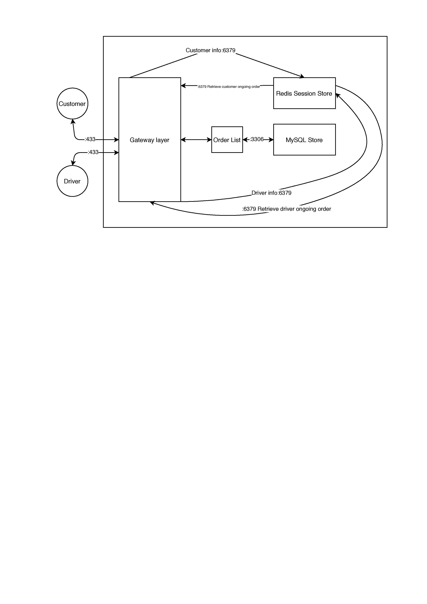

# SendIt

Group Members: Matthew Putra, Brandon Ly, Saksham Aggarwal, Khoa Luong

## Project Description

Sending packages to friends and family can take a lot of time, especially in the city where services like USPS or UPS can experience a lot of backup and the overall process can be a pain. Our target audience is anyone who wants to send packages within close distance but doesn’t want to have to wait days for it to arrive, even when the destination is relatively close. **SendIt** creates a platform where people can send packages to others within reasonably fast times (i.e. send a package to Maple Hall from McMahon Hall). SendIt customers can send packages by filling in an order form, and SendIt drivers can accept the order and complete it.

## Technical Description

### Use Cases & Priority 

| Priority | User            | Description                                                  | Technical Implementation                                     |
| -------- | --------------- | ------------------------------------------------------------ | ------------------------------------------------------------ |
| P0       | Customer/Driver | I want to be able to sign up as a new user                   | Authenticate data is valid, save data to DB                  |
| P0       | Customer/Driver | I want to be able to sign in with an existing account        | Authenticate credentials, save session into Redis            |
| P0       | Customer        | I want to be able to place an order                          | Authenticate order is valid, save order details to DB        |
| P0       | Driver          | I want to be able to see all the orders that I can accept (i.e. all the jobs available) | Get all the orders from DB that are marked incomplete/unaccepted |
| P0       | Driver          | I want to be able to accept an available order from the order list | Authenticated driver is eligible to accept a new order, save order-driver info to DB, save orderID to driver session |
| P0       | Driver          | I want to be able to mark my order as complete (i.e. validating I finished the job) | Authenticated driver has completed the order (e.g. give photo, order complete button), save order-driver info to DB |
| P0       | Customer        | I want to be able to see all the orders that I have created and the status of each of them | Looks up all the orders the user has submitted (both completed and non-completed orders), and display current order statuses |
| P1       | Customer        | I want to be able to update my order if it has not been accepted by a driver yet | Driver has not started/accepted delivery yet, authenticated update data is valid, update the order details to DB, send notification to Driver |

### End Points

* ```/v1/signup``` 
  * POST: Creates a new user and returns the user as a JSON object
    * 201: Successfully creates a new user
    * 400: User data is invalid
    * 405: Invalid request method
    * 415: Invalid request body
    * 500: Internal server error
* ```/v1/login```
  * GET: Returns the current logged in user in JSON
    * 200: Successfully returns the user
    * 401: User is not logged in
    * 405: Invalid request method
    * 500: Internal server error
  * POST: Log in a user and returns the user as a JSON object
    * 200: Successfully logs in a user, takes JSON
    * 401: Fail to authenticate the credentials
    * 405: Invalid request method
    * 415: Invalid request body
    * 500: Internal server error
  * DELETE: Log out a user
    * 200: Successfully logs out a customer
    * 405: Invalid request method
    * 500: Internal server error
* ```/v1/customer/{customerId}/order``` 
  * POST: Create new order, takes JSON
    * 201: Order successfully submitted
    * 400: Please provide a valid pickup location
    * 400: Please provide a valid dropoff location
    * 401: Unauthorized user
    * 405: Request method not allowed
    * 500: Unable to create order!
  * GET: Gives a list of all the orders that has been created for the current customer
    * 200: Successfully returns all the orders from logged in customer
    * 401: Unauthorized user
    * 404: CustomerID not found
    * 405: Request method not allowed
    * 500: Internal Server Error
* ```/v1/customer/{customerId}/order/{orderId}```
  * PATCH: Update an order, takes JSON
    * 200: Successfully updates an incomplete order
    * 400: Order already accepted by driver, cannot be cancelled
    * 401: Unauthorized user
    * 404: Order not found
    * 405: Request method not allowed
    * 500: Order cannot be updated
    * 500: Internal server error
  * GET: Gives information about the given orderID 
    * 200: Successfully returns the information about the order
    * 401: Unauthorized user
    * 404: Order not found
    * 405: Request method not allowed
    * 500: Internal server error
* ``` /v1/driver/{driverId}/orderList```
  * GET: Gives a list of all the orders that has not been completed
    * 200: Successfully returns all the orders that has not been completed
    * 401: Unauthorized user
    * 404: DriverID not found
    * 405: Request method not allowed
    * 500: Internal server error
* ```/v1/driver/accept/{orderId}```
  * PATCH: Change order status to 'In Progress'
    * 200: Successfully returns order information
    * 401: Unauthorized user
    * 404: Order not found
    * 405: Request method not allowed
    * 500: Order not accepted
    * 500: Internal server error
* ``` /v1/driver/complete/{orderId}```
  * PATCH: Change order status to 'Completed'
    * 200: Successfully returns order information
    * 401: Unauthorized user
    * 404: Order not found
    * 405: Request method not allowed
    * 500: Order not completed
    * 500: Internal server error
* ```/v1/driver/complete```
  * GET: Display all orders that has status 'Completed'
    * 200: Successfully returns list of all completed orders
    * 401: Unauthorized user
    * 405: Request method not allowed
    * 500: Internal server error
* ```/v1/driver/earnings```
  * GET: Returns the total earnings the driver has earned from all orders
    * 200: Successfully returns the total earning of the driver
    * 401: Unauthorized user
    * 405: Request method not allowed
    * 500: Internal server error
* ```/v1/driver/available```
  * GET: Display all orders that has status 'Submitted'
    * 200: Successfully returns list of all available orders
    * 401: Unauthorized user
    * 405: Request method not allowed
    * 500: Internal server error

### Infrastructure Diagram 



### Customer's account instructions
#### Log In Steps
1. LogIn with your customer account
2. If you don't have a customer account, sign up as a new user
2. Fill in all the information needed and put in 'customer' for the usertype
3. Click the 'Register' button and you will be navigated to the dashboard
#### Create New Order Steps
1. Click on 'Show Order List' button to navigate to customer order page
2. To create a new order, fill in the recipient's name and the pickup and dropoff location
3. Click the 'Place Order' button to submit the order
4. Click the 'Update Order List' button to see your new order under the 'Available Orders' table
#### Payment
1. Monitor your order page and see the status of your orders by clicking the 'Update Order List' button
2. If your order status has changed from 'Submitted' to 'In Progress' that means a driver has accepted your order
3. Wait for your driver to arrive at the pickup location and give the package to the driver
4. Look at the price from the order table and pay the amount to the driver
5. Monitor your order page again and check the status of your order
6. If your order status has changed from 'In Progress' to 'Completed' that means the driver has completed your order
#### Log Out Steps
1. If you are not in the dashboard page, click the 'Show Profile' button and you will be navigated to the dashboard
2. Click the 'Logout' button and you will be logged out

### Driver's account instructions
#### Log In Steps
1. LogIn with your customer account
2. If you don't have a customer account, sign up as a new user
2. Fill in all the information needed and put in 'driver' for the usertype
3. Click the 'Register' button and you will be navigated to the dashboard
#### Accepting An Order
1. Click on 'Show Order List' button to navigate to driver's order list page
2. Click the 'update list' button under 'Available Orders' table to see the available orders
3. Look through the 'Available Orders' table and pick the order you want to take
4. Type down the OrderID into the text box and click 'accept order' button
5. Click the 'update list' button to see the order being removed from that table
6. Go to the pick up location of your accepted order
7. Receive the package and money from the order creator
#### Completing An Order
1. Go to the drop off location from your accepted order and drop off the package there
2. Click on 'Show Order List' button to navigate to driver's order list page
3. Click the 'update list' button under 'Pending Orders' table to see your pending orders
4. Type down the OrderID from the order that you just completed into the text box and click 'complete order' button
5. Click the 'update list' button to see the order being removed from that table
6. Click the 'update list' button under 'Completed Orders' table to see the order that you have finished
#### Checking Your Earnings
1. If you are not in the dashboard page, click the 'Show Profile' button and you will be navigated to the dashboard
2. Click on the 'Total Earnings' button and you will see the total earnings you get from all your completed orders
#### Log Out Steps
1. If you are not in the dashboard page, click the 'Show Profile' button and you will be navigated to the dashboard
2. Click the 'Logout' button and you will be logged out


